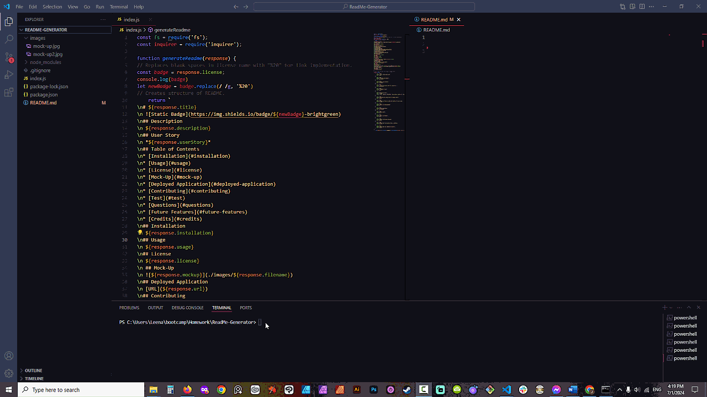

 

# Professional README Generator

 

## Description

 This is a README.md generator that works in the command line using node.js and inquirer prompt. 

## User Story 

 *AS A developer I WANT a README generator SO THAT I can quickly create a professional README for a new project.*

## Table of Contents

* [Installation](#installation)

* [Usage](#usage)

* [License](#license)

* [Mock-Up](#mock-up)

* [Deployed Application](#deployed-application)

* [Contributing](#contributing)

* [Test](#test)

* [Questions](#questions)

* [Future Features](#future-features)

* [Credits](#credits)

## Installation

 Download index.js >> open terminal or integrated terminal >> run node index.js >> answer prompts, you’re good to go! 

## Usage

 You can generate professional looking README files with this README generator.

## License

 Mozilla Public License 2.0 

 ## Mock-Up

 

## Deployed Application

 [URL](https://github.com/LeenaCruz/ReadMe-Generator)

## Contributing

 How to contribute to this project:

 You can contribute to this repo creating a pull request.

## Test

 Test writing different inputs or create a test case.

## Questions

 Write any questions to: [mail@mail.com](mailto:mail@mail.com)

 My GitHub: [LeenaCruz](https://github.com/LeenaCruz)

## Future Features

 Validate email, Format step by step installation.

## Credits

 [Validate Empy Input]( https://github.com/SBoudrias/Inquirer.js/issues/368) | [Badge Maker]( https://shields.io/badges) | [Markdown Syntax]( https://www.markdownguide.org/basic-syntax/#:~:text=To%20italicize%20text%2C%20add%20one,without%20spaces%20around%20the%20letters.&text=Italicized%20text%20is%20the%20*cat's%20meow*.) | [Replace empty strings]( https://www.geeksforgeeks.org/javascript-urlify-a-given-string-replace-spaces-is-%20/)
