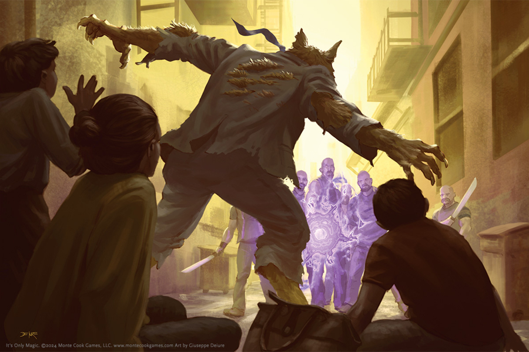

 

# Proyecto

 

## Description

 asi es

## User Story 

 *mi poryecto*

## Table of Contents

* [Installation](#installation)

* [Usage](#usage)

* [License](#license)

* [Mock-Up](#mock-up)

* [Deployed Application](#deployed-application)

* [Contributing](#contributing)

* [Test](#test)

* [Questions](#questions)

* [Future Features](#future-features)

* [Credits](#credits)

## Installation

 asjs

## Usage

 ajaj

## License

 Mozilla Public License 2.0 

 ## Mock-Up

 

## Deployed Application

 [URL](https://leenacruz.com)

## Contributing

 How to contribute to this project:

 asi

## Test

 asi

## Questions

 Write any questions to: [mail@mail.com](mailto:mail@mail.com)

 My GitHub: [LeenaCruz](https://github.com/LeenaCruz)

## Future Features

 asis

## Credits

 Gracias
